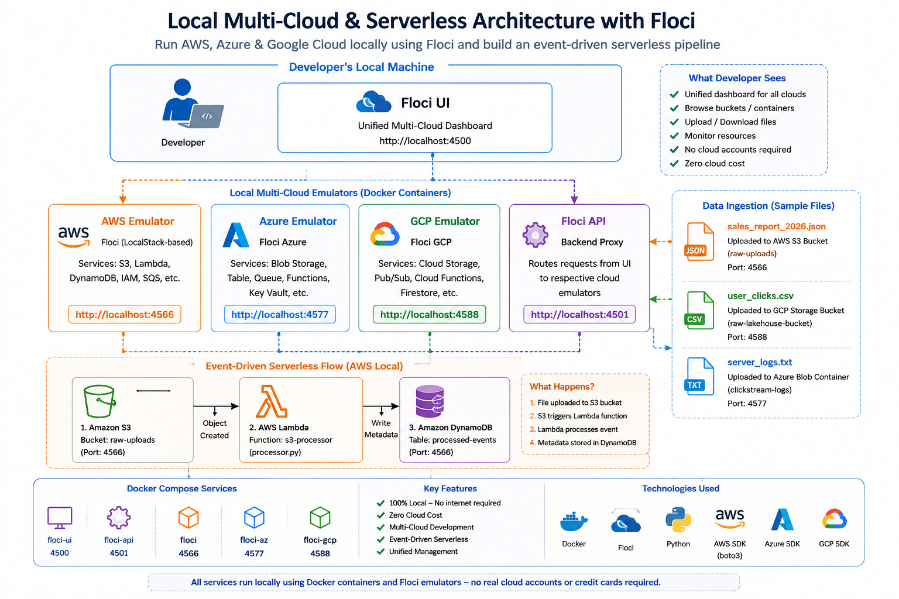
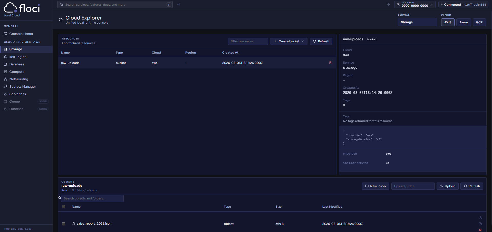
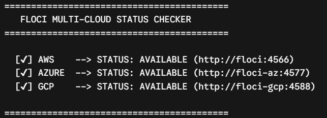
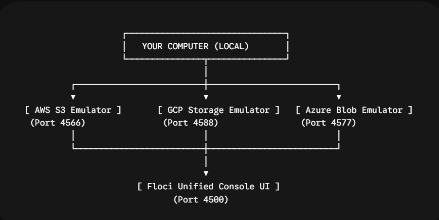
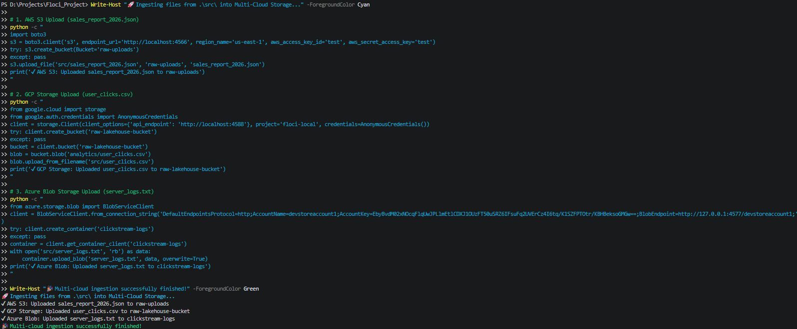
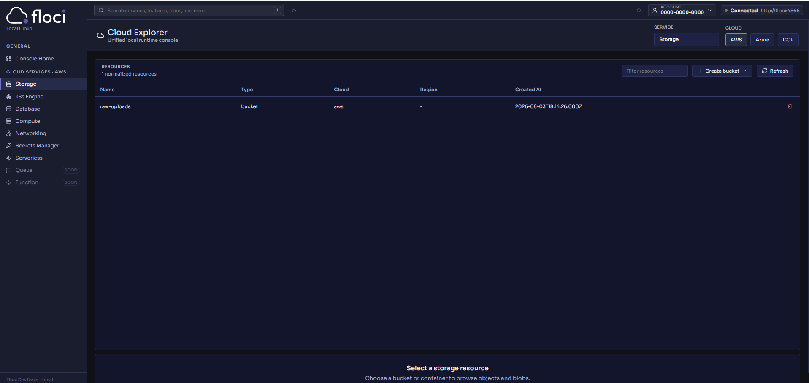
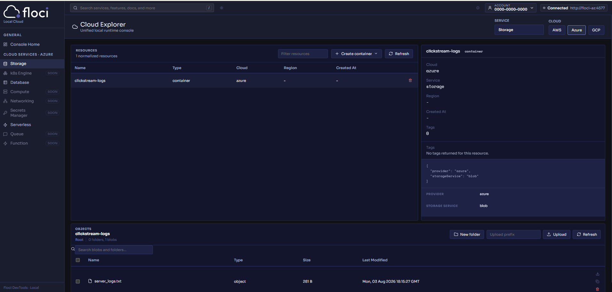
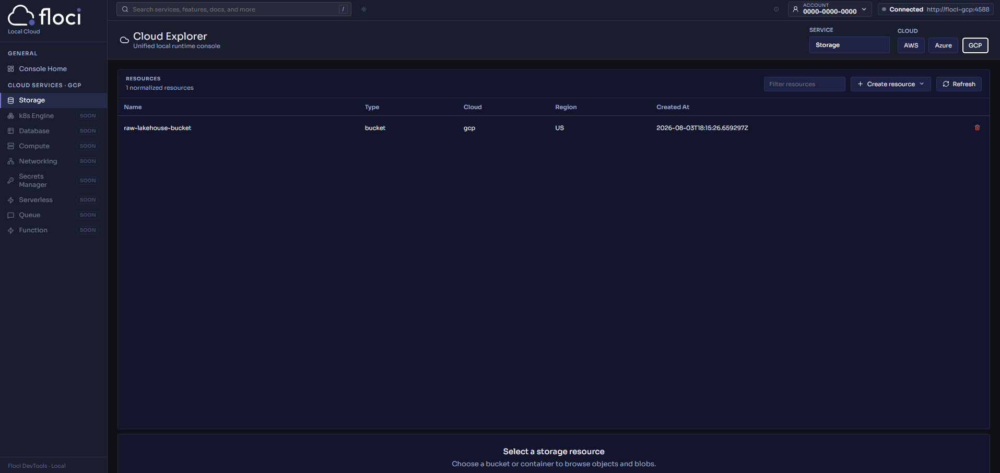
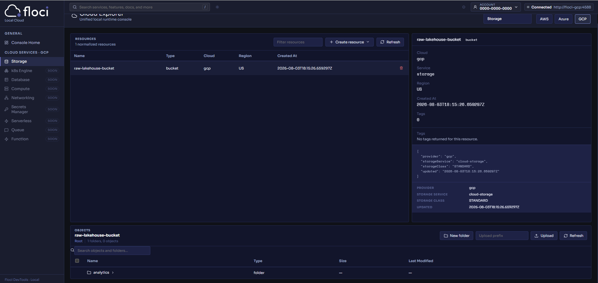
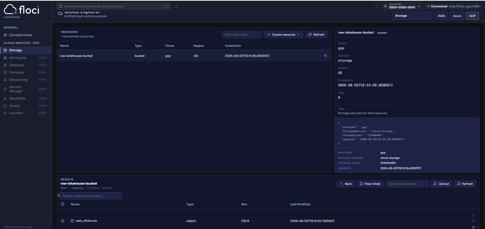

# 🌐 Floci Local Multi-Cloud Data Pipeline & Serverless Architecture

<p align="center">


)

</p>

<p align="center">
A complete Local Multi-Cloud development environment built using <b>Floci</b>, Docker and Python that emulates AWS, Azure and Google Cloud services entirely on a local machine without requiring cloud accounts or cloud infrastructure.
</p>


# 🏗️ Solution Architecture

The following diagram illustrates the complete local multi-cloud and event-driven serverless architecture implemented in this project.




---

# 📖 Table of Contents

- Introduction
- Project Overview
- Why Floci?
- Project Objectives
- What This Project Demonstrates
- Architecture
- End-to-End Workflow
- Features
- Repository Structure
- Technology Stack

---

# 📌 Introduction

Cloud-native development often requires developers to provision cloud resources before they can even begin testing.

Even something as simple as:

- creating an S3 bucket
- deploying a Lambda
- uploading a file
- testing an event trigger

usually requires

- cloud accounts
- internet connectivity
- cloud permissions
- billing setup
- deployment time

This slows down development and increases both cost and complexity.

This project demonstrates an alternative approach.

Using **Floci**, Docker and Python, I recreated a complete local cloud environment capable of simulating services from **AWS**, **Microsoft Azure**, and **Google Cloud Platform** directly on my machine.

The entire environment runs locally, allowing cloud-native applications to be developed, tested and validated without interacting with real cloud infrastructure.



---

# 🚀 Project Overview

This project showcases two major cloud engineering concepts running completely offline.

## 1️⃣ Local Multi-Cloud Data Pipeline

A unified ingestion pipeline uploads multiple file formats into three different cloud storage services simultaneously.

| Cloud | Service | Sample File |
|---------|----------|------------|
| AWS | S3 Bucket | `sales_report_2026.json` |
| Azure | Blob Storage | `server_logs.txt` |
| Google Cloud | Cloud Storage | `user_clicks.csv` |

Instead of provisioning three different cloud accounts, every service runs locally using Floci containers.



---

## 2️⃣ Event-Driven Serverless Architecture

The project also demonstrates an AWS-style serverless workflow.

```
S3 Upload

↓

Lambda Trigger

↓

Python Function

↓

DynamoDB Update
```

When a file is uploaded into the S3 bucket, a Lambda function is automatically triggered.

The Lambda function extracts metadata about the uploaded object and stores it inside DynamoDB.

This entire workflow executes locally without connecting to AWS.



---

# 💡 Why Floci?

Imagine building a house.

Normally, every time you want to test whether a door opens correctly, you would have to travel to another city where the house exists.

That is how traditional cloud development works.

Every small change requires deploying resources to AWS, Azure or Google Cloud before testing.

Floci completely changes this workflow.

Instead of deploying to remote cloud infrastructure, Floci recreates cloud services directly on your computer using Docker containers.

This enables developers to:

- build faster
- test instantly
- avoid cloud costs
- work offline
- experiment safely

without changing application code.

---

# 🎯 Project Objectives

The primary objectives of this project were:

✅ Build a fully local cloud development environment

✅ Emulate AWS, Azure and Google Cloud services

✅ Demonstrate multi-cloud storage workflows

✅ Implement an event-driven serverless architecture

✅ Validate Lambda execution locally

✅ Automate infrastructure deployment

✅ Remove dependency on real cloud accounts

✅ Demonstrate cloud-native development with zero infrastructure cost

---

# ✨ What This Project Demonstrates

This repository demonstrates practical implementations of the following concepts.

## Multi-Cloud Storage

- AWS S3
- Azure Blob Storage
- Google Cloud Storage


---

## Serverless Computing

- AWS Lambda
- Event Driven Processing
- Object Created Events

---

## Infrastructure

- Docker Compose
- Container Networking
- Local Cloud Emulation

---

## Data Engineering Concepts

- Data Ingestion
- Object Storage
- Event Processing
- Metadata Processing
- NoSQL Storage

---

## Python Development

- boto3
- Azure Blob SDK
- Google Cloud SDK
- AWS Lambda Handler

---

# 🏗 Architecture

> **Replace the image below with your architecture diagram.**

```
                           YOUR COMPUTER

                                  │

      ┌────────────────────────────────────────────────────┐

                      Docker Compose

      └────────────────────────────────────────────────────┘

          │                 │                  │

          ▼                 ▼                  ▼

      AWS Emulator      Azure Emulator     GCP Emulator

          │                 │                  │

          ▼                 ▼                  ▼

      Amazon S3         Azure Blob      Cloud Storage

          │                 │                  │

          └──────────────┬─────────────────────┘

                         ▼

                  Floci Unified UI

                    localhost:4500

                         │

                         ▼

                  Local Development

```

---

# 🔄 End-to-End Workflow

The complete workflow implemented in this project is shown below.

```text
                    Sample Data Files

                           │

        ┌──────────────────┼───────────────────┐

        ▼                  ▼                   ▼

sales_report.json     server_logs.txt     user_clicks.csv

        │                  │                   │

        ▼                  ▼                   ▼

     AWS S3          Azure Blob         GCP Storage

        │

        ▼

Object Created Event

        │

        ▼

 AWS Lambda Function

        │

        ▼

Metadata Extraction

        │

        ▼

 DynamoDB Table

        │

        ▼

Processing Verification

```

The Floci Dashboard allows all three cloud environments to be monitored through a single unified interface.

---

# ⭐ Features

## Multi-Cloud

- Local AWS S3 Emulator
- Local Azure Blob Emulator
- Local Google Cloud Storage Emulator
- Unified Cloud Dashboard

---

## Serverless

- AWS Lambda Deployment
- Automatic S3 Event Trigger
- Python Lambda Function
- DynamoDB Integration

---

## Infrastructure

- Docker Compose
- Persistent Storage
- Container Networking
- Local API Endpoints

---

## Automation

- Infrastructure Provisioning using PowerShell
- Automatic Bucket Creation
- Automatic DynamoDB Creation
- Lambda Deployment Script
- End-to-End Validation Script

---

## Developer Experience

- No Cloud Account Required
- No Credit Card Required
- Offline Development
- Millisecond Feedback
- Zero Infrastructure Cost

---

# 📁 Repository Structure

```
Floci_Project/

│

├── docker-compose.yml

│

└── src/

    ├── demo.ps1

    ├── processor.py

    ├── test_demo.py

    ├── sales_report_2026.json

    ├── server_logs.txt

    └── user_clicks.csv

```

---

# 📂 Repository Breakdown

## docker-compose.yml

Defines and launches the local multi-cloud infrastructure.

It starts:

- Floci UI
- Floci API
- AWS Emulator
- Azure Emulator
- Google Cloud Emulator

along with the required networking and environment configuration.

---

## src/demo.ps1

Automates the deployment of the local AWS serverless environment by:

- Creating an S3 bucket
- Creating a DynamoDB table
- Deploying the Lambda function
- Configuring S3 event notifications

---

## src/processor.py

Contains the Lambda handler.

When a new object is uploaded into S3, the Lambda function:

- receives the event
- extracts metadata
- writes the metadata into DynamoDB
- confirms successful processing

---

## src/test_demo.py

Validates the complete event-driven workflow.

The script:

- uploads a sample file
- waits for Lambda execution
- queries DynamoDB
- verifies successful processing

---

## Sample Data Files

| File | Purpose |
|-------|----------|
| sales_report_2026.json | Sample sales transaction uploaded into AWS S3 |
| user_clicks.csv | Sample clickstream dataset uploaded into Google Cloud Storage |
| server_logs.txt | Sample application logs uploaded into Azure Blob Storage |

---

# 🛠 Technology Stack

| Category | Technologies |
|-----------|--------------|
| Programming Language | Python |
| Containerization | Docker |
| Orchestration | Docker Compose |
| Local Cloud Platform | Floci |
| AWS Services | S3, Lambda, DynamoDB |
| Azure Services | Blob Storage |
| Google Cloud | Cloud Storage |
| SDKs | boto3, Azure Storage SDK, Google Cloud SDK |
| Scripting | PowerShell |

# 🚀 Getting Started

This section provides a complete walkthrough for setting up and running the project on your local machine.

---

# 📋 Prerequisites

Before starting, make sure the following software is installed.

| Software | Version |
|-----------|----------|
| Docker Desktop | Latest |
| Docker Compose | Included with Docker Desktop |
| Python | 3.10 or later |
| AWS CLI | Latest |
| PowerShell | Windows PowerShell 5+ |
| Git | Latest |

Verify the installation using:

```powershell
docker --version

docker compose version

python --version

aws --version

git --version
```

---

# 📥 Clone the Repository

Clone the repository from GitHub.

```bash
git clone <YOUR_REPOSITORY_URL>

cd Floci_Project
```

---

# 📁 Project Structure

After cloning, your repository should look like this.

```text
Floci_Project/

│

├── docker-compose.yml

│

└── src/

    ├── demo.ps1

    ├── processor.py

    ├── test_demo.py

    ├── sales_report_2026.json

    ├── user_clicks.csv

    └── server_logs.txt
```

---

# 🐳 Start the Local Multi-Cloud Infrastructure

This project uses Docker Compose to launch the complete Floci environment.

The following services are started automatically:

- Floci UI
- Floci API
- AWS Emulator
- Azure Emulator
- Google Cloud Emulator

Run:

```powershell
docker compose up -d
```

Docker will download the required images if they are not already present.

---

# 🔍 Verify Running Containers

Check that every container is running successfully.

```powershell
docker ps
```

Expected containers include:

```
floci-ui

floci-api

floci

floci-az

floci-gcp
```

---

# 🌐 Open the Floci Dashboard

Once the containers are running, open your browser.

```
http://localhost:4500
```



This dashboard provides a unified interface for viewing resources across AWS, Azure and Google Cloud running locally.

---

# ⚙ Understanding docker-compose.yml

The Docker Compose configuration launches five services.

| Service | Purpose |
|----------|----------|
| floci-ui | Web Dashboard |
| floci-api | Backend API |
| floci | AWS Emulator |
| floci-az | Azure Emulator |
| floci-gcp | Google Cloud Emulator |

The services communicate using an internal Docker network.

This allows each emulator to communicate without requiring internet connectivity.

---

# 🌐 Internal Network

```
                     Docker Network

                    floci_default

                           │

        ┌──────────────────┼───────────────────┐

        ▼                  ▼                   ▼

      floci           floci-az          floci-gcp

        │

        ▼

     floci-api

        │

        ▼

      floci-ui
```

---

# 🔌 Port Mapping

The project exposes the following ports.

| Port | Service |
|-------|----------|
| 4500 | Floci Dashboard |
| 4501 | Floci API |
| 4566 | AWS Emulator |
| 4577 | Azure Emulator |
| 4588 | Google Cloud Emulator |

---

# 📂 Sample Data

Three sample datasets are included in the repository.

| File | Cloud Destination |
|-------|------------------|
| sales_report_2026.json | AWS S3 |
| user_clicks.csv | Google Cloud Storage |
| server_logs.txt | Azure Blob Storage |

These files are used to demonstrate multi-cloud data ingestion.

---

# 🚀 Deploy the Local Serverless Architecture

After Docker Compose is running, deploy the AWS serverless components.

Open PowerShell inside the project directory.

Run:

```powershell
.\src\demo.ps1
```

This script automatically performs the following operations.

---

## Step 1

Creates an S3 bucket.

```
raw-uploads
```

---

## Step 2

Creates a DynamoDB table.

```
processed-events
```

---

## Step 3

Packages the Lambda source code.

```
processor.py

↓

processor.zip
```

---

## Step 4

Deploys the Lambda function.

```
Function Name

↓

s3-processor
```

---

## Step 5

Registers S3 ObjectCreated events.

Whenever a new file is uploaded into the bucket,

```
raw-uploads
```

the Lambda function is automatically triggered.

---

# ⚡ Event-Driven Workflow

```
Upload File

↓

Amazon S3

↓

ObjectCreated Event

↓

Lambda Trigger

↓

processor.py

↓

Extract Metadata

↓

DynamoDB

↓

Processing Complete
```

---

# 🧠 What Happens Inside processor.py?

The Lambda function receives the S3 event.

For every uploaded object it extracts:

- Bucket Name

- Object Name

- File Size

It then writes this information into the DynamoDB table.

Example stored record:

```json
{
    "event_id":"sales_report_2026.json",
    "bucket":"raw-uploads",
    "file_size_bytes":369,
    "status":"PROCESSED"
}
```

---

# 🧪 Test the Complete Pipeline

Once the infrastructure has been deployed, execute:

```powershell
python .\src\test_demo.py
```

The script automatically:

- uploads a sample object

- waits for Lambda execution

- queries DynamoDB

- verifies successful processing

No manual interaction is required.

---

# ✅ Expected Console Output

A successful execution should produce output similar to:

```
Dropping sample file into local S3 bucket...

Waiting for Lambda execution...

Checking DynamoDB...

SUCCESS!

Local Event-Driven Pipeline Executed Perfectly
```

---

# 🔍 Verify the Dashboard

Open

```
http://localhost:4500
```

You should be able to browse resources from

- AWS


- Azure



- Google Cloud





through a single dashboard.

---

# 🩺 Health Checks

You can verify that each emulator is responding correctly.

## AWS Emulator

```powershell
Invoke-RestMethod `
-Uri "http://localhost:4566/_floci/health"
```

---

## Azure Emulator

```powershell
Invoke-RestMethod `
-Uri "http://localhost:4577/devstoreaccount1?comp=list" `
-Headers @{
"x-ms-version"="2020-04-08"
}
```

---

## Google Cloud Emulator

```powershell
Invoke-RestMethod `
-Uri "http://localhost:4588/storage/v1/b?project=floci-local"
```

---

## Floci API

```powershell
Invoke-RestMethod `
-Uri "http://localhost:4500/api/clouds/aws/status"
```

---

# 🧹 Stop the Environment

When finished, stop every service.

```powershell
docker compose down
```

To remove containers and volumes completely:

```powershell
docker compose down -v
```

---


# 🔍 Source Code Walkthrough

This section explains how each file in the repository contributes to the complete local multi-cloud and serverless architecture.

Rather than simply running commands, understanding how these files interact provides insight into how cloud-native applications are built and tested locally.

---

# 📂 Source Files

## 1. docker-compose.yml

This file is responsible for creating the entire local cloud environment.

Instead of manually starting individual Docker containers, Docker Compose orchestrates every required service with a single command.

### Services Started

| Service | Purpose |
|----------|----------|
| floci-ui | Unified dashboard for managing local cloud resources |
| floci-api | Backend API that communicates with the cloud emulators |
| floci | Local AWS emulator |
| floci-az | Local Azure emulator |
| floci-gcp | Local Google Cloud emulator |

The compose file also:

- Configures environment variables
- Exposes required ports
- Creates the Docker network
- Links all services together

This allows every container to communicate internally without depending on external cloud services.

---

## 2. demo.ps1

This PowerShell script automates the setup of the local AWS serverless environment.

Instead of manually creating resources one by one, the script provisions everything automatically.

### Operations Performed

### Create S3 Bucket

```
raw-uploads
```

The bucket stores uploaded files locally.

---

### Create DynamoDB Table

```
processed-events
```

The table stores metadata generated after files are processed.

---

### Deploy Lambda Function

The script compresses

```
processor.py
```

into a deployment package and creates a Lambda function named

```
s3-processor
```

---

### Configure Event Notifications

Finally, the script connects S3 with Lambda.

Whenever a new object is uploaded into

```
raw-uploads
```

Lambda executes automatically.

No manual trigger is required.

---

## 3. processor.py

This is the heart of the event-driven architecture.

It acts as the AWS Lambda function.

### Responsibilities

Receive the S3 event.

↓

Extract information from the uploaded object.

↓

Store metadata in DynamoDB.

↓

Return a successful execution response.

---

### Event Processing

When a file is uploaded, Lambda receives an event similar to:

```
Bucket Name

Object Name

Object Size

Upload Event
```

The function extracts:

- Bucket Name
- File Name
- File Size

and inserts a new record into DynamoDB.

Example:

| Field | Value |
|--------|--------|
| event_id | sales_report_2026.json |
| bucket | raw-uploads |
| file_size_bytes | 369 |
| status | PROCESSED |

---

## 4. test_demo.py

This script validates that the complete architecture works correctly.

Instead of manually uploading files and checking DynamoDB, the script performs the entire verification automatically.

### Workflow

Upload sample JSON file

↓

Wait for Lambda execution

↓

Query DynamoDB

↓

Verify processing

↓

Display success message

This confirms that:

- S3 upload works
- Lambda executes
- DynamoDB stores metadata
- Event notification is functioning correctly

---

## 5. sales_report_2026.json

A sample JSON dataset representing sales transactions.

Purpose:

- Demonstrate object uploads
- Trigger Lambda execution
- Simulate structured business data

---

## 6. user_clicks.csv

A sample CSV dataset containing user clickstream events.

Purpose:

- Demonstrate ingestion into Google Cloud Storage
- Represent analytical data

---

## 7. server_logs.txt

A sample log file representing application logs.

Purpose:

- Demonstrate Azure Blob Storage uploads
- Represent operational log ingestion

---

# 🧠 How Everything Works Together

The repository combines multi-cloud storage with an event-driven AWS workflow.

```
                    docker compose up

                            │

        ┌───────────────────┼───────────────────┐

        ▼                   ▼                   ▼

      AWS               Azure              Google Cloud

        │                   │                   │

        ▼                   ▼                   ▼

 Local Storage       Local Blob        Local Cloud Storage

        │

        ▼

Run demo.ps1

        │

        ▼

Create S3 Bucket

        │

        ▼

Create DynamoDB

        │

        ▼

Deploy Lambda

        │

        ▼

Configure Notifications

        │

        ▼

Run test_demo.py

        │

        ▼

Upload File

        │

        ▼

Lambda Executes

        │

        ▼

Metadata Stored

        │

        ▼

Success
```

---

# 📚 Key Concepts Demonstrated

This project demonstrates several important cloud engineering concepts.

### Multi-Cloud Development

Running AWS, Azure and Google Cloud simultaneously on a local machine.

---

### Event-Driven Architecture

Automatically responding to object uploads using event notifications.

---

### Serverless Computing

Using Lambda functions without managing servers.

---

### Infrastructure Automation

Provisioning cloud resources using PowerShell.

---

### Cloud Storage

Working with

- Amazon S3
- Azure Blob Storage
- Google Cloud Storage

inside a local development environment.

---

### NoSQL Databases

Using DynamoDB for storing processed metadata.

---

# 🎯 Learning Outcomes

Building this project helped me gain practical experience with:

- Local cloud emulation using Floci
- Docker Compose orchestration
- Container networking
- AWS S3 object storage
- AWS Lambda deployment
- Event-driven architectures
- DynamoDB integration
- Python cloud SDKs
- Infrastructure automation with PowerShell
- Multi-cloud development workflows
- Testing cloud-native applications without cloud accounts

---

# 💡 Why This Project Matters

Traditional cloud development often requires developers to provision infrastructure before they can begin testing.

This introduces:

- Cloud costs
- Deployment delays
- Internet dependency
- Account management
- Configuration complexity

This project demonstrates an alternative workflow where cloud-native applications can be developed, tested and validated entirely on a local machine.

Benefits include:

- Zero cloud cost
- Faster development cycles
- Offline testing
- Safe experimentation
- Reproducible environments

For developers learning cloud technologies, this provides an efficient way to understand cloud services before deploying to production.

---

# 🚀 Future Improvements

Potential enhancements for this project include:

- Integrating Apache Kafka for event streaming
- Building automated CI/CD pipelines
- Adding Infrastructure as Code using Terraform
- Supporting additional cloud services
- Implementing automated monitoring and logging
- Adding unit and integration tests
- Deploying the same architecture to real cloud providers
- Extending the pipeline with data transformation workflows

---

# 🤝 Acknowledgements

This project was built using:

- **Floci** for local cloud emulation
- **Docker** for containerization
- **Python** for application development
- **AWS SDK for Python (boto3)** for interacting with AWS services
- **Azure Storage SDK** for Blob Storage integration
- **Google Cloud Storage SDK** for GCP storage operations

Special thanks to the Floci project for making multi-cloud development accessible without requiring cloud accounts or infrastructure costs.

---

# 📄 License

This repository is intended for educational purposes and experimentation with local cloud-native development.

Feel free to fork the project, extend it and adapt it to your own learning or development workflows.

---

# ⭐ If You Found This Repository Useful

If this project helped you understand local multi-cloud development or event-driven serverless architectures:

- ⭐ Star this repository
- 🍴 Fork it to experiment further
- 💡 Open an issue for suggestions or improvements

Contributions and feedback are always welcome.

---

# 👨‍💻 Author

**Soniya Kambli**

Data Engineer | SnowPro Certified | Microsoft Fabric Certified | Databricks Certified Data Engineer Associate

Passionate about building modern data engineering solutions across cloud platforms, with a focus on Data Engineering, Cloud Computing, ETL/ELT pipelines, and scalable analytics architectures.

---

## 🎉 Conclusion

This project demonstrates that cloud-native applications do not always require access to real cloud infrastructure. By leveraging Floci, Docker, and Python, it is possible to emulate AWS, Azure, and Google Cloud services locally, build event-driven serverless workflows, and validate multi-cloud architectures with zero cloud cost.

The repository serves as both a practical learning resource and a reproducible reference implementation for developers interested in local cloud development, serverless computing, and multi-cloud data engineering.
